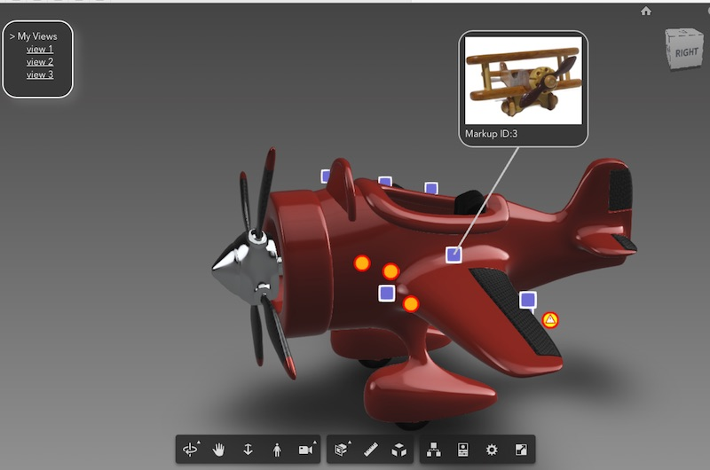

## 3D Markup with Multi-icons and Info-Card

#### Try the DEMO:  [Click Here](https://wallabyway.github.io/markupExt/) 

> <a href="https://wallabyway.github.io/markupExt/img/markupExt.webm"></a>
> (click the image to see [video](https://wallabyway.github.io/markupExt/img/markupExt.webm))

### Overview

This is an extension to APS Viewer, so you can attach 3D markers to your scene with a pop-out info-card.  I originally used the same extension for the AR ConXTech demo (see http://vrock.it and original blog post).  
I needed to show 1000's of RFI's and Issues in a large Revit scene, so I needed a markup technique to render a large number of points.


Following on from Philippe's great post, I added a couple of things...

##### > Multi-Icons:  


To use multi-icons, I used a spritesheet and added this to the pointcloud fragment shader:
```
gl_FragColor = gl_FragColor * texture2D(tex, vec2((gl_PointCoord.x+vColor.y*1.0)/4.0, 1.0-gl_PointCoord.y));
```

##### > Point Scaling:  
I also needed to scale the points so the points looked like they stuck to the object as I zoom in and out. I added this line of code to the vertex shader:
```
gl_PointSize = size * ( size / (length(mvPosition.xyz) + 1.0) );
```

##### > Mobile Performance [Test](https://wallabyway.github.io/JCI-POC-piping/) :

...and finally, to get great performance on iPad and Android, I needed to avoid using too many div elements.  Now I just use one.  You can see the performance in the [video below](https://wallabyway.github.io/markupExt/img/markupExtPerfm.webm) 

Here are 10,000 RFI's, etc running at 60 FPS...


> <a href="https://wallabyway.github.io/markupExt/img/markupExtPerfm.webm"></a>
> (click the image to see [video](https://wallabyway.github.io/markupExt/img/markupExtPerfm.webm))

--
.

## How to use:

Steps:

1. Add `<script src="markupExt.js"></script>` to your `index.html`
2. Load extension after `'onSuccess'` event, like so...

```
    function onSuccess() {
        viewer.loadExtension("markup3d");
    }
```
3. Send your markup data via an event `'newData'`, like this...

```
// create 20 markup points at random x,y,z positions. 

var dummyData = [];
for (let i=0; i<20; i++) {
    dummyData.push({
        icon:  Math.round(Math.random()*3),  
        x: Math.random()*300-150, 
        y: Math.random()*50-20, 
        z: Math.random()*150-130
    });
}        
window.dispatchEvent(
	new CustomEvent('newData', {'detail': dummyData})
);
```
> Note: `icon:` integer corresponds to an icon in the spritesheet (see options below). For example 0="Issue", 1="BIMIQ_Warning", 2="RFI", 3="BIMIQ_Hazard"

4. Add a 'onMarkupClick' Listener

```
window.addEventListener("onMarkupClick", e=>{
    var elem = $("label");
    elem.style.display = "block";
    moveLabel(e.detail);
    elem.innerHTML = `<br>Markup ID:${e.detail.id}`;
}, false);
```

5. Add a 'onMarkupMove' Listener

```
window.addEventListener("onMarkupMove", e=>{
   moveLabel(e.detail)
}, false);

function moveLabel(p) {
   elem.style.left = ((p.x + 1)/2 * window.innerWidth) + 'px';
   elem.style.top =  (-(p.y - 1)/2 * window.innerHeight) + 'px';            
}
```

--

.

## 2. Features and Options

##### > Icons / SpriteSheet
 Here are the current icons I use:


 
 Change the `docs/img/icons.png` file to your own icon set.

Note: The icon value corresponds to spritesheet  position. So icon #0="Issue", #1="BIMIQ_Warning", #2="RFI", #3="BIMIQ_Hazard"


##### > Positioning your Info-Card
You can reposition the popup Info-Card offset using the settings at the top of the `'docs/markupExt.js'` file

```
this.labelOffset = new THREE.Vector3(120,120,0);  // label offset 3D line offset position
this.xDivOffset = -0.2;  // x offset position of the div label wrt 3D line.
this.yDivOffset = 0.4;  // y offset position of the div label wrt 3D line.
```

##### > Adjusting the marker's 'Hit Radius' and 'Icon Size'
```
function markup3d(viewer, options) {
    this.raycaster.params.PointCloud.threshold = 5; // hit-test markup size.  Change this if markup 'hover' doesn't work
    this.size = 150.0; // markup size.  Change this if markup size is too big or small
```
##### > Make Points appear 'in Front' with Transparency
If you want the markup points to always appear on top of objects, change the `depthWrite` from `true` to `false`.  Also change the `impl.scene` to `impl.sceneAfter`.  Finally, to make the points transparent, add opacity: 0.4 to the material shader.

```
    this.scene = viewer.impl.scene; 
// change this to viewer.impl.sceneAfter with transparency

    this.initMesh_PointCloud = function() {
         ...
         ...
            var material = new THREE.ShaderMaterial({
                ...
                depthWrite: true,
                depthTest: true,
```

--
.

## Info-Card details 



##### > Line Color styling:
You can change the line color at the top of the `docs/markupExt.js` here:

```
function markup3d(viewer, options) {
   this.lineColor = 0xcccccc;
```
##### > Info-Card Styling
The Info-Card colors and CSS styling can be found in the `'docs/index.html'` here:

```
        #label { 
            display:none; 
            position:fixed; 
            z-index:2; 
            border: 2px solid #ccc; 
            background-color: #404040; 
            border-radius: 25px; 
            padding: 10px;
        }
        #label img { width:200px; }
```
The info-card pictures can be found in the folder `'docs/img/0..5.jpg'`. Click on an info card will pick one of the jpg's below (based on the MarkupID):


  |  |  |  |  |  |
 --- | --- | --- | --- | --- | ---


The HTML string/template is generated by the main `'docs/app.js'`.  

```
elem.innerHTML = `
 <br>Markup ID:${e.detail.id}`;
```

> This is where you would add your own customized div with React.js or Vue.js, after you receive the 'onMarkupClick' event


##### > Creating your own Camera Views

Steps:

1. Set up your view state (set pivot, environment, FOV, etc)
2. Go to Chrome Browser debug console
3. Enter the following:

```
v=viewer.getState();delete(v.seedURN);delete(v.objectSet);delete(v.renderOptions);delete(v.cutplanes);JSON.stringify(v)
```

4. Copy and paste the resulting JSON, into the `'viewStates'` variable in `app.js` line65

--

.
## Render Performance Tips:

##### > Reduce Pixel Density
Use 
>     window.devicePixelRatio = 1;
Use a reduced pixel density, to get better render performance for a trade-off in pixelation.  Noticable on retina screens like mobile and OSX laptops.
See the `docs/app.js` file for details.

##### > Use Mesh Consolidation
```
    var options = {
        env: "Local",
        useConsolidation: true,
        useADP: false,
    }
```
This change makes a different on larger scenes, but your mileage may vary.

--

### References

- Hit Test PointClouds: [StackOverflow](https://stackoverflow.com/questions/28209645/raycasting-involving-individual-points-in-a-three-js-pointcloud)
- Phillip's PointCloud: [BLOG](https://forge.autodesk.com/blog/high-performance-3d-markups-pointcloud-forge-viewer) 
- ConXTech AR Demo: [DEMO](http://vrock.it) / [BLOG](https://forge.autodesk.com/blog/conxtech-rethinking-job-site-apples-arkit-forge)

